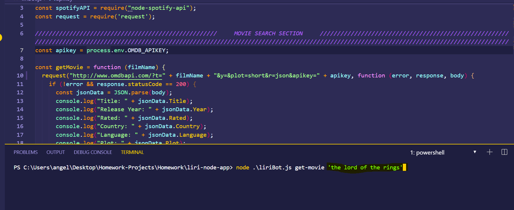
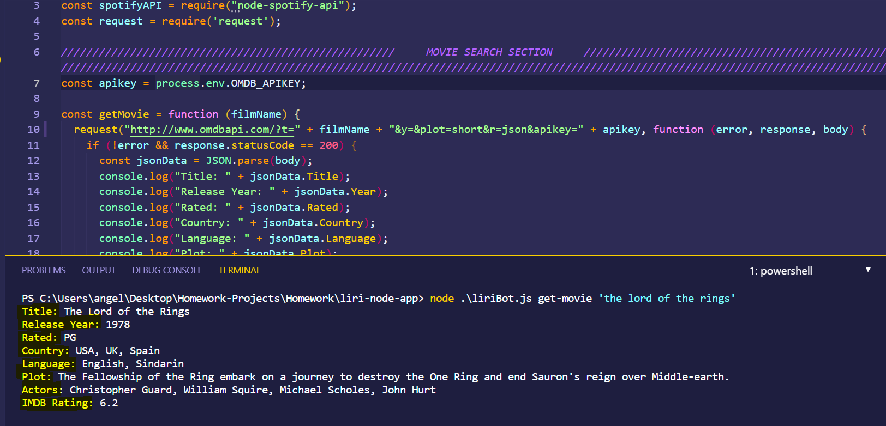
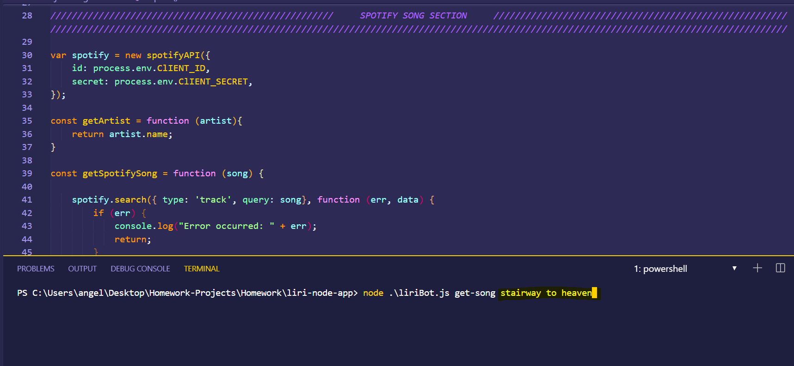
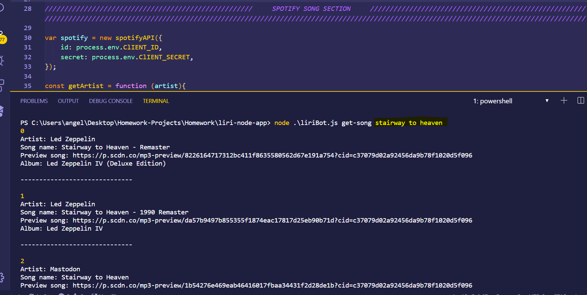

# LiriBot <h1> 

##LIRI (Language Interpretation and Recognition Interface)
  This application takes in a command from the user and returns data on the console. Liribot can look for songs on Spotify, and movies on OMDB. 

##Technologies Used:
* Node.JS
* [DotEnv](https://www.npmjs.com/package/dotenv)
* [Node-Spotify-API](https://www.npmjs.com/package/node-spotify-api)
* [Request](https://www.npmjs.com/package/request)
* OMBD API

## Using LiriBot to search for OMDB movies<h3>
 1. On the console run the LiriBot file as a node command and then type in get-movie followed by the movie you would like to search for (in this case the movie is "the matrix")
  
  
 2. After hitting enter the console log will dsiplay information on the movie searched
  

## Using LiriBot to search for songs on Spotify<h3>
 1. On the console run the LiriBot file as a node command and then type in 'get-song' followed by the song you would like to search
  
  
 2. After hitting enter the console log will dsiplay information on the song searched
  